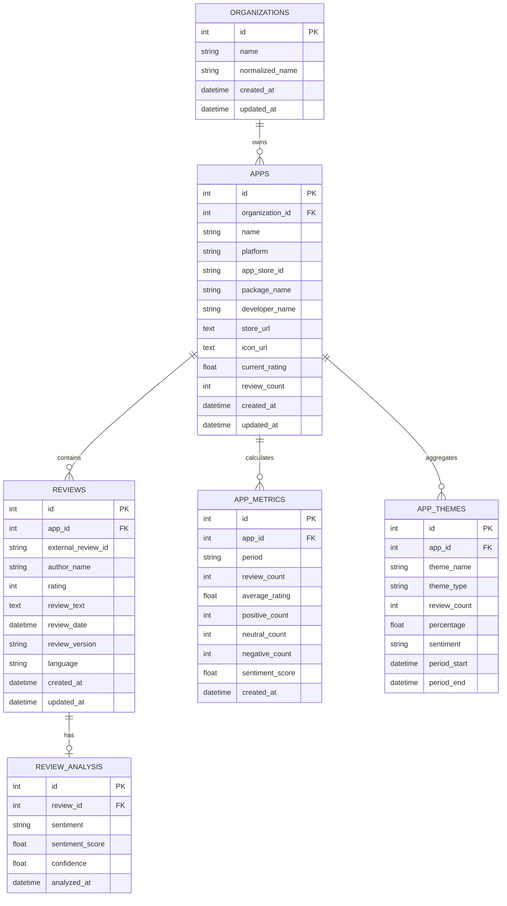

# App Review Intelligence Platform
## Complete Architecture, System Design & Business Logic Specification

---

## Table of Contents
1. [Executive Summary & Problem Statement](#1-executive-summary--problem-statement)
2. [High-Level Architecture](#2-high-level-architecture)
3. [Core Design Principles & Patterns](#3-core-design-principles--patterns)
4. [End-to-End Business Logic Pipelines](#4-end-to-end-business-logic-pipelines)
   - [4.1 Organization Normalization & App Discovery](#41-organization-normalization--app-discovery)
   - [4.2 Confidence Matching Algorithm](#42-confidence-matching-algorithm)
   - [4.3 Review Ingestion & Incremental Synchronization](#43-review-ingestion--incremental-synchronization)
   - [4.4 NLP Sentiment Analysis Strategy](#44-nlp-sentiment-analysis-strategy)
   - [4.5 Domain Keyword & Theme Detection Engine](#45-domain-keyword--theme-detection-engine)
   - [4.6 Actionable AI Insights Synthesis](#46-actionable-ai-insights-synthesis)
   - [4.7 Cross-Platform (iOS vs Android) Parity Engine](#47-cross-platform-ios-vs-android-parity-engine)
5. [Database Architecture & Data Models](#5-database-architecture--data-models)
   - [5.1 Entity Relationship Diagram](#51-entity-relationship-diagram)
   - [5.2 Table Definitions & Constraints](#52-table-definitions--constraints)
   - [5.3 Indexing & Performance Strategy](#53-indexing--performance-strategy)
6. [API Architecture & Service Layer Contracts](#6-api-architecture--service-layer-contracts)
7. [Frontend Architecture & UI Design System](#7-frontend-architecture--ui-design-system)
8. [Resilience, Fault Tolerance & Error Handling](#8-resilience-fault-tolerance--error-handling)
9. [Future Scalability & AI Roadmap](#9-future-scalability--ai-roadmap)

---

## 1. Executive Summary & Problem Statement

### 1.1 The Core Problem
Modern organizations distribute digital experiences across multiple mobile titles on both the **Apple App Store (iOS)** and **Google Play Store (Android)**. Product, Engineering, and Executive teams encounter significant operational friction:
- **Scattered Data**: Reviews are fragmented across platforms, locales, and releases.
- **Manual Overhead**: Teams manually read thousands of reviews, leading to cognitive fatigue and biased sample sizes.
- **Platform Blind Spots**: Discrepancies between iOS and Android performance (e.g. Android-specific crash spikes) go unnoticed until ratings drop.
- **Actionability Gap**: Raw ratings (e.g., 4.2 ★) tell *how* an app is rated, but fail to explain *why* users are unhappy or which specific subsystem needs engineering intervention.

### 1.2 The Platform Mission
The **App Review Intelligence Platform** provides an autonomous, end-to-end intelligence engine that:
1. Discovers all mobile applications owned by an enterprise across iOS and Android from a single input name.
2. Ingests, normalizes, and deduplicates customer reviews incrementally.
3. Classifies sentiment valence and compound polarity using NLP.
4. Detects recurring functional friction themes (e.g., *Login & Auth*, *Crashes*, *Battery Drain*, *Payments*).
5. Synthesizes automated, rule-based **Actionable Insights** and cross-platform parity matrices.

---

## 2. High-Level Architecture

The platform follows a **Strict Layered Architecture (Clean Architecture)** where dependencies point strictly inward. 

```
┌─────────────────────────────────────────────────────────────────────────┐
│                             REACT FRONTEND                              │
│         (Vite + React Router + Recharts + Glassmorphism UI)             │
└────────────────────────────────────┬────────────────────────────────────┘
                                     │  HTTP REST (JSON) / Vite Proxy
┌────────────────────────────────────▼────────────────────────────────────┐
│                             FASTAPI BACKEND                             │
│  ┌───────────────────────────────────────────────────────────────────┐  │
│  │                            API LAYER                              │  │
│  │       (FastAPI Routers, Pydantic Request/Response Schemas)        │  │
│  └─────────────────────────────────┬─────────────────────────────────┘  │
│                                    │ Dependency Injection               │
│  ┌─────────────────────────────────▼─────────────────────────────────┐  │
│  │                          SERVICE LAYER                            │  │
│  │   • OrganizationService       • SentimentService (VADER Strategy) │  │
│  │   • AppDiscoveryService       • ThemeService (Issue Clustering)   │  │
│  │   • ReviewService (Sync)      • DashboardService (Insights)       │  │
│  └──────────────────┬──────────────────────────────┬─────────────────┘  │
│                     │                              │                    │
│  ┌──────────────────▼───────────┐    ┌─────────────▼─────────────────┐  │
│  │       REPOSITORY LAYER       │    │       COLLECTOR LAYER         │  │
│  │   • OrganizationRepository   │    │  (CollectorFactory Pattern)   │  │
│  │   • AppRepository            │    │  ├── AppleAppStoreCollector   │  │
│  │   • ReviewRepository         │    │  └── GooglePlayCollector      │  │
│  │   • MetricRepository         │    └─────────────┬─────────────────┘  │
│  └──────────────────┬───────────┘                  │                    │
│                     │ SQLAlchemy 2.0 ORM           │ External Store APIs│
│  ┌──────────────────▼──────────────────────────────▼─────────────────┐  │
│  │                           DATA LAYER                              │  │
│  │       • MySQL 8.0+ (utf8mb4 / utf8mb4_unicode_ci)                 │  │
│  │       • Alembic Schema Migration Engine                           │  │
│  └───────────────────────────────────────────────────────────────────┘  │
└─────────────────────────────────────────────────────────────────────────┘
```

---

## 3. Core Design Principles & Patterns

The platform strictly adheres to enterprise software engineering principles:

| Principle / Pattern | Implementation in Platform |
| :--- | :--- |
| **Separation of Concerns** | Routes do **not** contain SQL queries or scraping logic. They delegate strictly to Services, which delegate data access to Repositories. |
| **Strategy Pattern** | `SentimentAnalyzer` abstract base class with `VaderSentimentAnalyzer` implementation. Future LLM or Transformer models can be swapped in without modifying business logic. |
| **Factory Pattern** | `CollectorFactory` dynamically resolves platform collectors (`APPLE` -> `AppleAppStoreCollector`, `GOOGLE_PLAY` -> `GooglePlayCollector`). |
| **Repository Pattern** | Decouples database queries, transactions, and eager loading (`joinedload`) from business logic. |
| **Dependency Injection** | FastAPI `Depends` manages database session lifecycles (`get_db`) and repository/service instantiations per request. |
| **Idempotent Syncing** | Review ingestion uses composite unique keys `(app_id, external_review_id)` to ensure zero duplicate database records during sync. |

---

## 4. End-to-End Business Logic Pipelines

### 4.1 Organization Normalization & App Discovery

```
[User Input: "Meta"]
         │
         ▼
[Organization Normalization]
   • Strip legal suffixes (Inc, LLC, Corp, Technologies, GmbH, Ltd)
   • Unicode NFKD normalization & lowercase conversion
   • Normalized Token: "meta"
         │
         ├───► [Query Apple iTunes Search API]
         └───► [Query Google Play Scraper Engine]
         │
         ▼
[Raw App Metadata Collection]
```

### 4.2 Confidence Matching Algorithm
External store search results often include unrelated titles. The system executes deterministic matching to classify confidence:

```python
def calculate_match_confidence(org_name, developer_name, app_name):
    # 1. Exact normalized match -> HIGH
    if norm(org_name) == norm(developer_name):
        return "HIGH"

    # 2. Known enterprise parent-child alias map -> HIGH
    # (e.g. Meta owns Instagram Inc, WhatsApp LLC, Meta Platforms Inc)
    if norm(developer_name) in ALIASES[norm(org_name)]:
        return "HIGH"

    # 3. Substring containment -> HIGH
    if norm(org_name) in norm(developer_name):
        return "HIGH"

    # 4. Token set intersection -> MEDIUM
    if words(org_name).intersection(words(developer_name)):
        return "MEDIUM"

    # 5. Low relevance -> LOW (Filtered out from auto-discovery)
    return "LOW"
```

Only `HIGH` and `MEDIUM` confidence apps are persisted to the database.

---

### 4.3 Review Ingestion & Incremental Synchronization

When an app is synchronized (manually or periodically):
1. **Collector Invocation**: Fetches recent reviews from the respective store RSS/API.
2. **In-Memory Normalization**: Normalizes dates, authors, star ratings, and cleans text.
3. **Database Diffing**: Queries existing `external_review_id`s in MySQL for that specific `app_id`.
4. **Delta Insertion**: Inserts only novel reviews (`reviews_inserted`).
5. **Trigger NLP & Aggregation**: Newly inserted reviews automatically flow into the Sentiment and Theme detection pipelines.

```
Incoming Reviews: [Rev_1, Rev_2, Rev_3, Rev_4]
Existing in DB:   [Rev_1, Rev_2]
                     │
                     ▼
             Delta to Insert: [Rev_3, Rev_4] (Zero Duplicates)
```

---

### 4.4 NLP Sentiment Analysis Strategy

The sentiment pipeline implements the **Strategy Pattern**:

```
[Review Text] ──► [SentimentAnalyzer Interface] ──► [VaderSentimentAnalyzer]
                                                            │
                      ┌─────────────────────────────────────┴─────────────────────────────────────┐
                      ▼                                     ▼                                     ▼
           Compound >= +0.05                     -0.05 < Compound < +0.05              Compound <= -0.05
           Sentiment: POSITIVE                   Sentiment: NEUTRAL                    Sentiment: NEGATIVE
           Confidence: 0.60 - 0.99               Confidence: 0.50 - 0.95               Confidence: 0.60 - 0.99
```

- **Output Record**: Stored in `review_analysis` with `sentiment_score` (-1.0 to +1.0) and `confidence` (0.0 to 1.0).
- **Abstract Design**: Can be extended with `TransformerSentimentAnalyzer` or `LLMSentimentAnalyzer` without breaking existing database schemas.

---

### 4.5 Domain Keyword & Theme Detection Engine

Reviews are categorized across 10 functional friction and praise domains:

| Theme Name | Target Subsystem Keywords |
| :--- | :--- |
| **Login & Auth** | `login`, `sign in`, `password`, `2fa`, `otp`, `verification`, `locked`, `credentials` |
| **Crashes & Stability** | `crash`, `freeze`, `force close`, `black screen`, `glitch`, `buggy`, `broken` |
| **Performance & Speed** | `slow`, `lag`, `sluggish`, `stutter`, `buffering`, `responsive`, `snappy`, `fast` |
| **Ads & Monetization** | `ads`, `popup`, `commercial`, `subscription`, `paywall`, `expensive`, `premium` |
| **Notifications & Alerts** | `notification`, `push notification`, `alert`, `badge`, `sound`, `delayed notice` |
| **UI / UX Design** | `interface`, `ui`, `ux`, `layout`, `dark mode`, `design`, `navigation`, `clean` |
| **Camera & Media** | `camera`, `video`, `photo`, `filter`, `reels`, `stories`, `audio`, `upload` |
| **Payments & Billing** | `payment`, `billing`, `charged`, `refund`, `receipt`, `in-app purchase`, `card` |
| **Battery & Resources** | `battery`, `drain`, `power`, `overheating`, `ram`, `memory leak` |
| **Privacy & Security** | `privacy`, `security`, `permissions`, `tracking`, `spam`, `scam`, `hacked` |

**Theme Sentiment Attribution**:
- For each theme mention, the review's sentiment score is weighted.
- If the average theme score is $\ge +0.10 \implies$ **POSITIVE (Praise)**.
- If the average theme score is $\le -0.10 \implies$ **NEGATIVE (Friction Issue)**.
- Otherwise $\implies$ **GENERAL (Neutral)**.

---

### 4.6 Actionable AI Insights Synthesis

Rather than presenting raw numbers, the heuristics engine evaluates multi-dimensional rules to output prioritized executive recommendations:

1. **Negative Spike Detection**:
   $$\text{If } \frac{\text{Negative Reviews}}{\text{Total Reviews}} > 25\% \implies \textbf{Severity: HIGH}$$
   *Insight: "Elevated Negative Sentiment. Investigate latest changelog."*

2. **Lead Friction Driver**:
   Identifies the `#1` negative theme by review volume.
   *Insight: "Primary Friction: Login & Auth (accounting for 34% of negative reviews)."*

3. **Platform Disparity Rule**:
   $$\text{If } \text{NegPct}_{\text{Android}} > 1.3 \times \text{NegPct}_{\text{iOS}} \implies \textbf{Severity: MEDIUM}$$
   *Insight: "Higher Negative Rate on Android. Audit OS fragmentation & battery optimization."*

4. **Value & Praise Driver**:
   Identifies the top positive theme.
   *Insight: "Core Value Driver: UI/UX Design (92% positive sentiment). Highlight in app store screenshots."*

---

### 4.7 Cross-Platform (iOS vs Android) Parity Engine

The platform automatically correlates sibling titles across stores (e.g., *Spotify iOS* vs *Spotify Android*):
- Side-by-side Star Rating comparison.
- Side-by-side Sentiment Score $(-1.0 \text{ to } +1.0)$.
- Divergence in Top Complaints (e.g. Android experiencing battery drain while iOS experiences login timeouts).

---

## 5. Database Architecture & Data Models

### 5.1 Entity Relationship Diagram



### 5.2 Table Definitions & Constraints

- **`organizations`**: Master entity for corporate brands.
- **`apps`**: Stores iOS (`APPLE`) and Android (`GOOGLE_PLAY`) titles. Foreign key cascade deletion ensures data integrity.
- **`reviews`**: Contains individual customer feedback. Unique constraint `uq_app_external_review (app_id, external_review_id)` guarantees mathematical idempotency on review syncs.
- **`review_analysis`**: 1-to-1 relationship with `reviews` storing NLP valence metrics.
- **`app_metrics`**: Snapshot storage of aggregated ratings and sentiment splits for sub-second dashboard retrieval without raw review re-computation.
- **`app_themes`**: Statistical distributions of recurring topic clusters.

### 5.3 Indexing & Performance Strategy
Key database indexes configured in Alembic migrations:
- `ix_organizations_normalized_name`
- `ix_apps_organization_id`, `ix_apps_platform`
- `ix_reviews_app_id`, `ix_reviews_external_review_id`, `ix_reviews_review_date`
- `ix_review_analysis_review_id`
- `ix_app_metrics_app_id`, `ix_app_themes_app_id`

---

## 6. API Architecture & Service Layer Contracts

All endpoints return JSON and are prefixed with `/api`.

### Key REST Endpoints

| Method | Endpoint | Description |
| :--- | :--- | :--- |
| `POST` | `/api/organizations/discover` | Triggers multi-store discovery for an organization name |
| `GET` | `/api/organizations` | Lists all discovered organizations with pagination |
| `GET` | `/api/organizations/{id}` | Retrieves organization metadata |
| `GET` | `/api/organizations/{id}/apps` | Returns all mobile applications belonging to an organization |
| `GET` | `/api/organizations/{id}/dashboard` | Returns executive dashboard, comparison matrix, and actionable insights |
| `GET` | `/api/apps/{id}` | Returns single-app intelligence dashboard and platform parity |
| `POST` | `/api/apps/{id}/sync` | Incrementally syncs reviews from store, runs NLP, and updates metrics |
| `GET` | `/api/apps/{id}/reviews` | Paginated review explorer with sentiment and rating filters |
| `GET` | `/api/apps/{id}/sentiment` | Retrieves sentiment valence breakdown |
| `GET` | `/api/apps/{id}/themes` | Returns positive and negative topic themes |
| `GET` | `/api/apps/{id}/trends` | Returns timeline trend data for charts |
| `GET` | `/health` | Application health check endpoint |

---

## 7. Frontend Architecture & UI Design System

### 7.1 Architecture
Built with **React 18 + Vite + React Router v6**:
- **API Client Layer (`src/services/api.js`)**: Encapsulates all Axios HTTP calls behind clean promise functions.
- **Vite Reverse Proxy**: Configured in `vite.config.js` to route `/api` to `http://127.0.0.1:8000`, eliminating CORS and IPv6 resolution errors.
- **Responsive Layout**: Desktop-first design optimized for executive dashboards.

### 7.2 UI Design System (`src/index.css`)
- **Theme**: Dark glassmorphism (`#090D16` primary background with `rgba(30, 41, 59, 0.7)` frosted glass cards).
- **Typography**: Google Fonts **Outfit** (headings) and **Inter** (body & metrics).
- **Vibrant Accent Palette**:
  - Indigo/Violet Gradient: `linear-gradient(135deg, #6366F1 0%, #A855F7 50%, #EC4899 100%)`
  - Positive Sentiment: `#10B981` (Emerald)
  - Neutral Sentiment: `#F59E0B` (Amber)
  - Negative Sentiment: `#EF4444` (Rose)
- **Data Visualizations**: Recharts Area & Timeline charts with custom gradient fills and tooltips.

---

## 8. Resilience, Fault Tolerance & Error Handling

1. **Store Failure Isolation**: If Apple App Store API rate-limits or fails, Google Play discovery still completes successfully, and vice versa.
2. **Centralized Exception Handling**: Custom `AppIntelligenceException` classes map cleanly to structured HTTP responses:
   ```json
   {
     "error": {
       "code": "APP_NOT_FOUND",
       "message": "Application could not be found.",
       "details": null
     }
   }
   ```
3. **Database Portability**: Dialect-agnostic SQL queries ensure 100% compatibility across MySQL 8.0+, MariaDB, and SQLite.
4. **Structured Logging**: Timestamped logging captures discovery events, review counts, duplicates skipped, and NLP completion.

---

## 9. Future Scalability & AI Roadmap

1. **LLM Root-Cause Analysis**: Transition from keyword heuristics to Claude / OpenAI API agents for deep semantic summarization of bugs.
2. **Asynchronous Distributed Workers**: Integration of Celery / Redis for scheduled background review scraping across 100+ applications.
3. **Automated Release Correlation**: Linking GitHub / App Store release version tags with sentiment drop anomalies.
4. **Executive PDF & Excel Reporting**: One-click export of monthly intelligence summaries for leadership teams.
