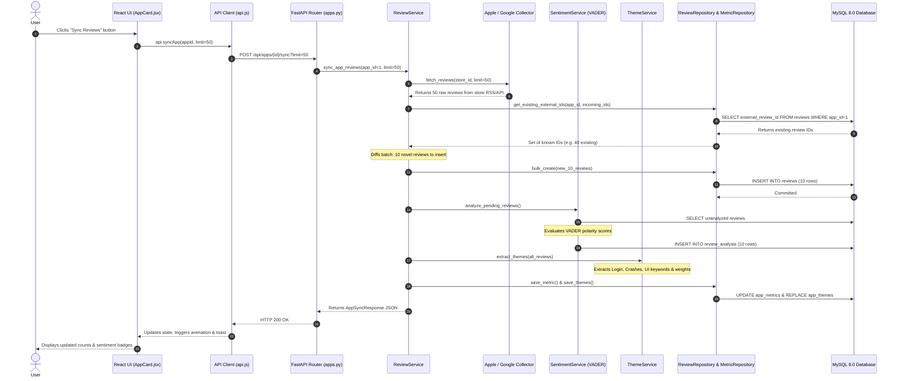

# App Review Intelligence Platform
## Layer Connectivity & System Flow Specification

---

## 1. High-Level Layer Topology

The platform is engineered using a **7-Tier Layered Architecture**. Each layer communicates only with adjacent layers through strict typed interfaces, preventing leaky abstractions and tight coupling.

```
┌────────────────────────────────────────────────────────────────────────────┐
│                        TIER 1: PRESENTATION LAYER                          │
│     React 18 Components: OrganizationSearch, AppCard, SentimentSummary     │
└─────────────────────────────────────┬──────────────────────────────────────┘
                                      │ Invokes JS async functions
┌─────────────────────────────────────▼──────────────────────────────────────┐
│                    TIER 2: CLIENT SERVICE & PROXY LAYER                    │
│     src/services/api.js (Axios) ──► Vite Server Proxy (/api ──► :8000)     │
└─────────────────────────────────────┬──────────────────────────────────────┘
                                      │ HTTP Request / Response (JSON)
┌─────────────────────────────────────▼──────────────────────────────────────┐
│                      TIER 3: API CONTROLLER LAYER                          │
│     FastAPI Route Handlers (backend/app/api/routes/*.py)                   │
└─────────────────────────────────────┬──────────────────────────────────────┘
                                      │ Depends(get_service) - DI
┌─────────────────────────────────────▼──────────────────────────────────────┐
│                      TIER 4: BUSINESS SERVICE LAYER                         │
│     AppDiscoveryService, ReviewService, SentimentService, ThemeService     │
└──────────────────┬──────────────────────────────────────┬──────────────────┘
                   │                                      │
                   │ CollectorFactory                     │ Injected Repositories
┌──────────────────▼──────────────────┐   ┌───────────────▼──────────────────┐
│     TIER 5: INTEGRATION LAYER       │   │    TIER 6: REPOSITORY LAYER      │
│  Apple & Google Play Collectors     │   │ Organization, App, Review Repos  │
│  VADER Sentiment Strategy           │   │ Encapsulates all SQL Queries     │
└─────────────────────────────────────┘   └───────────────┬──────────────────┘
                                                          │ SQLAlchemy 2.0 ORM
                                          ┌───────────────▼──────────────────┐
                                          │      TIER 7: DATABASE LAYER      │
                                          │ MySQL 8.0+ (utf8mb4_unicode_ci)  │
                                          └──────────────────────────────────┘
```

---

## 2. Layer-by-Layer Connectivity Breakdown

### Tier 1 ──► Tier 2: Component to Axios Service

**How it connects:**
When a user types `"Meta"` and clicks the **Analyze** button, the React component invokes the client service method in `src/services/api.js`.

```jsx
// File: frontend/src/pages/Home.jsx (Presentation Tier)
const handleSearch = async (orgName) => {
  setIsLoading(true);
  // Calls Tier 2 Client Service
  const result = await api.discoverOrganization(orgName);
  navigate(`/organizations/${result.organization_id}`);
};
```

---

### Tier 2 ──► Tier 3: Vite Proxy to FastAPI Router

**How it connects:**
1. Axios sends `POST /api/organizations/discover`.
2. Vite's dev proxy in `vite.config.js` intercepts `/api` and forwards the request to `http://127.0.0.1:8000`.
3. FastAPI matches the route registered in `backend/app/api/routes/organizations.py`.

```javascript
// File: frontend/src/services/api.js (Client Service Tier)
export const api = {
  discoverOrganization: async (name) => {
    const response = await apiClient.post('/organizations/discover', { name });
    return response.data;
  },
};
```

```javascript
// File: frontend/vite.config.js (Proxy Layer)
export default defineConfig({
  server: {
    proxy: {
      '/api': {
        target: 'http://127.0.0.1:8000',
        changeOrigin: true,
      }
    }
  }
})
```

---

### Tier 3 ──► Tier 4: FastAPI Router to Business Service (via Dependency Injection)

**How it connects:**
FastAPI utilizes `Depends(get_app_discovery_service)` to automatically instantiate the database session, construct repositories, and inject them into the `AppDiscoveryService`.

```python
# File: backend/app/api/routes/organizations.py (API Controller Tier)
@router.post("/discover", response_model=OrganizationDiscoverResponse)
async def discover_organization_apps(
    request: OrganizationDiscoverRequest,
    discovery_service: AppDiscoveryService = Depends(get_app_discovery_service),  # <-- DI Wire
):
    # Route contains ZERO SQL or Scraping. Delegates 100% to Service Layer.
    org, apps = await discovery_service.discover_for_organization(request.name.strip())
    return OrganizationDiscoverResponse(
        organization_id=org.id,
        name=org.name,
        apps_found=len(apps),
    )
```

```python
# File: backend/app/api/dependencies.py (Dependency Injection Wire)
def get_app_discovery_service(
    org_repo: OrganizationRepository = Depends(get_org_repo),
    app_repo: AppRepository = Depends(get_app_repo),
) -> AppDiscoveryService:
    return AppDiscoveryService(org_repo, app_repo)
```

---

### Tier 4 ──► Tier 5: Service Layer to Store Collectors & Sentiment Strategy

**How it connects:**
The `AppDiscoveryService` uses `CollectorFactory` to retrieve store collectors and query external APIs asynchronously.

```python
# File: backend/app/services/app_discovery_service.py (Service Tier)
collectors = CollectorFactory.get_all_collectors()

# Queries Apple App Store and Google Play in parallel
tasks = [collector.discover_apps(clean_name, limit=15) for collector in collectors]
results = await asyncio.gather(*tasks, return_exceptions=True)
```

```python
# File: backend/app/collectors/factory.py (Factory Pattern)
class CollectorFactory:
    _collectors = {
        "APPLE": AppleAppStoreCollector(),
        "GOOGLE_PLAY": GooglePlayCollector(),
    }
    @classmethod
    def get_collector(cls, platform: str) -> BaseCollector:
        return cls._collectors[platform.upper()]
```

---

### Tier 4 ──► Tier 6: Service Layer to Repository Layer

**How it connects:**
The Service layer never issues raw SQL. It passes validated Python data structures to the Repository Layer.

```python
# File: backend/app/services/app_discovery_service.py
existing = self.app_repo.find_existing(
    organization_id=org.id,
    platform=app_dict["platform"],
    app_store_id=app_dict.get("app_store_id"),
    package_name=app_dict.get("package_name"),
)
if not existing:
    new_app = self.app_repo.create(
        organization_id=org.id,
        name=app_dict["name"],
        platform=app_dict["platform"],
        # ...
    )
```

---

### Tier 6 ──► Tier 7: Repository Layer to SQLAlchemy & MySQL Database

**How it connects:**
The Repository layer interacts with MySQL using SQLAlchemy 2.0 ORM sessions. Parameterized queries protect against SQL injection.

```python
# File: backend/app/repositories/app_repository.py (Repository Tier)
class AppRepository:
    def __init__(self, db: Session):
        self.db = db

    def find_existing(self, organization_id: int, platform: str, app_store_id=None, package_name=None):
        query = self.db.query(App).filter(
            App.organization_id == organization_id,
            App.platform == platform
        )
        if app_store_id:
            res = query.filter(App.app_store_id == app_store_id).first()
            if res: return res
        if package_name:
            res = query.filter(App.package_name == package_name).first()
            if res: return res
        return None

    def create(self, **kwargs) -> App:
        app = App(**kwargs)
        self.db.add(app)
        self.db.commit()
        self.db.refresh(app)
        return app
```

---

## 3. Complete End-to-End Sequence Diagram: "Sync Reviews"

The diagram below traces the complete round-trip flow when a user clicks **"Sync Reviews"** on an app card:



---

## 4. Key Architectural Guarantees

1. **No Leaky Boundaries**: Database sessions (`SessionLocal`) are strictly managed by FastAPI dependency injection context managers and are automatically closed after each request.
2. **Idempotency**: External store duplicate reviews are intercepted before database insertion using both in-memory set diffing and MySQL composite unique keys `(app_id, external_review_id)`.
3. **Pluggable Sentiment Engine**: The `SentimentService` depends on the `SentimentAnalyzer` interface, enabling zero-code-change transitions from VADER to LLM/Transformers in the future.
4. **Sub-second Dashboard Performance**: Aggregated metrics are stored in `app_metrics` and `app_themes` upon ingestion, allowing dashboards to render instantly without scanning millions of raw review records on every page load.
